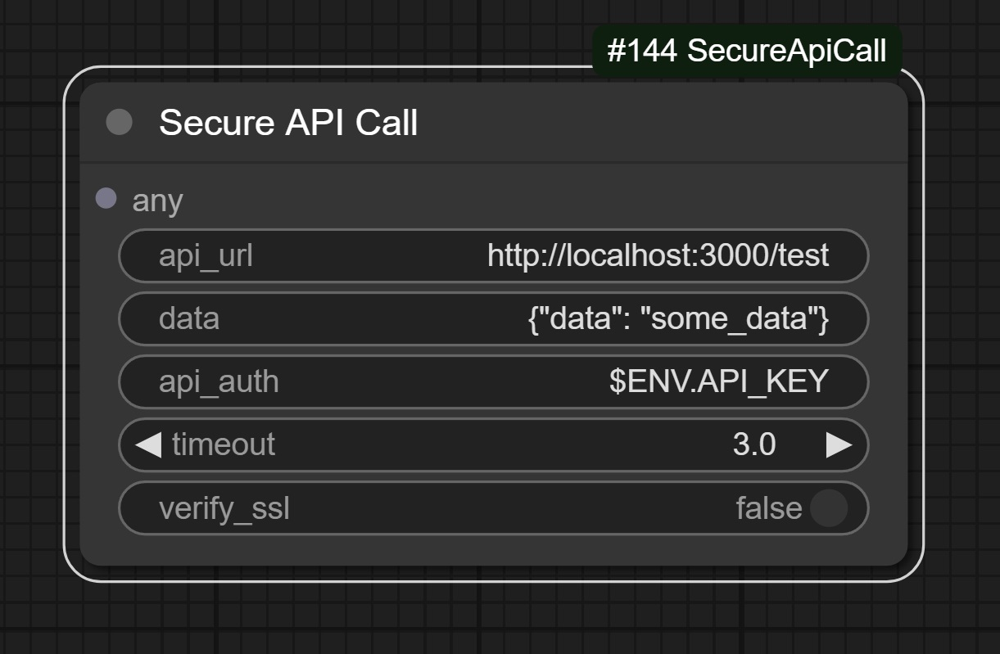

# ComfyUI Secure API Call

This package provides custom nodes to ComfyUI to POST data to a secure API.

## Secure API Call

Send a JSON message to the specified URL. Supports basic api key authentication.

## A Note on Security

99.99% of the time, you should use the prefix '$ENV.<Some_Variable_Name>' to access the environment variables for the api_url and api_auth fields.
This keeps your secrets out of the metadata of the output.

**IF YOU DO NOT ADD THE --disable-metadata FLAG TO COMFYUI, THIS _WILL_ SPILL SECRETS IN THE METADATA OF THE OUTPUT.**
**You must ensure that the metadata is not attached to _any_ outputs, as some nodes will not respect the --disable-metadata flag and will attach their own metadata.**

This package is designed to be used in a secure environment. It is not recommended to use this package in a public environment.
Make sure to add the --disable-metadata flag to your comfyui command, to prevent the metadata from being attached outputs -- but be aware that some nodes will not respect this flag and will attach their own metadata.

In the event that you need to use the metadata, you absolutely must use the prefix '$ENV.<Some_Variable_Name>' in any fields you want to keep secret.

## Installation

1. Download the package from the ComfyUI extensions tab.
2. Install the package.
3. Add the Secure API Call node to your ComfyUI workflow.
4. Configure the node with the URL, API key, and any other necessary parameters.
5. Run the workflow and check the output (especially the metadata, it should be empty).
